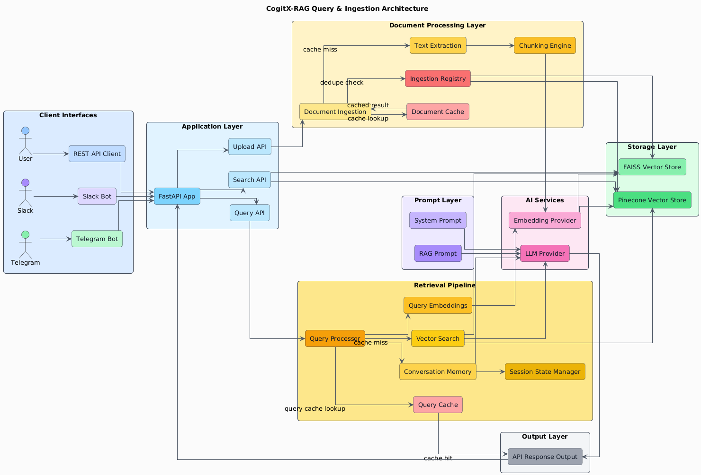
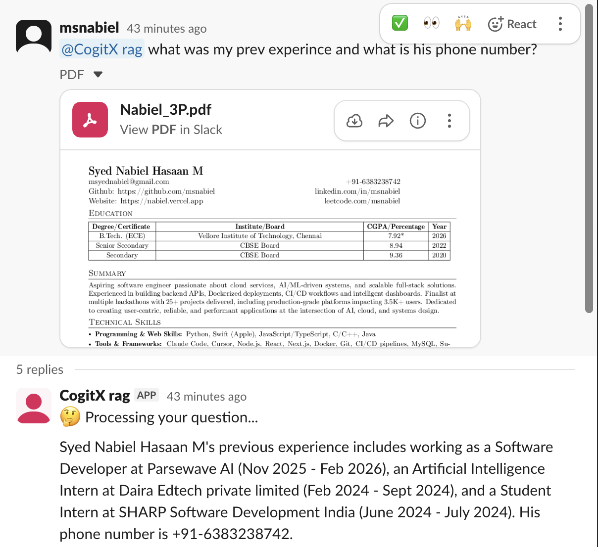
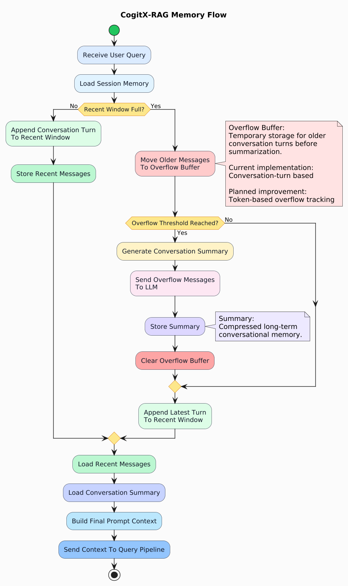

# CogitX-RAG

FastAPI-based RAG system with document ingestion, conversational memory, Slack/Telegram integrations, configurable embeddings, and pluggable vector stores.

## Architecture



## Demo

🎥 [Watch Full Demo Video](https://drive.google.com/file/d/1EjqoRS3pI4mJeXKQSxurDXGZ_lO1P3Bl/view?usp=sharing)

[](https://drive.google.com/file/d/1EjqoRS3pI4mJeXKQSxurDXGZ_lO1P3Bl/view?usp=sharing)

## memory



## Features

| Feature | Status | Notes |
|---|---|---|
| Document upload & ingestion | ✅ | API upload + ingestion pipeline |
| Chunking & embeddings | ✅ | Configurable embedding providers |
| Retrieval & generation | ✅ | Retrieval + LLM response flow |
| Confidence scoring | ✅ | Returned in query response |
| Slack bot | ✅ | Thread-based conversational memory |
| Session memory | ✅ | Window + overflow summarization |
| OCR support | ✅ | Tesseract + LibreOffice integration |
| Multiple embedding modes | ✅ | Local, OpenAI, Gemini |
| Multiple vector stores | ✅ | FAISS + Pinecone support |
| Telegram bot | ⚠️ | Present but not tested |
| Citations | ⚠️ | line numbering can be noisy sometimes |
| Graph retrieval | 🚧 | Modules exist, runtime integration pending |
| Semantic memory | 🚧 | Runtime wiring incomplete |
| Structured memory | 🚧 | Runtime wiring incomplete |


## Embedding Modes

| Mode | Description |
|---|---|
| `local_single` | Uses one local embedding model |
| `local_dual` | Concatenates two local models |
| `openai` | OpenAI embeddings |
| `gemini` | Gemini embeddings |

### Default Local Models

| Model | Dimension |
|---|---|
| `BAAI/bge-small-en-v1.5` | 384 |
| `all-MiniLM-L6-v2` | 384 |

Combined vector size in `local_dual` mode: **768**


## Memory System

| Behavior | Description |
|---|---|
| Recent window | Keeps latest conversation turns |
| Overflow storage | Moves older turns out of active window |
| Summarization | Uses LLM to summarize overflow |
| Prompt assembly | Injects summary + recent history |


## Configuration

| File | Purpose |
|---|---|
| `settings.yaml` | Main application config |
| `.env` | Secrets and API keys |
| `src/config/settings.py` | Config loader |

### Important Config Keys

| Key | Purpose |
|---|---|
| `llm.default_llm_provider` | Active LLM backend |
| `embeddings.embedding_provider` | Embedding provider |
| `vector_store.vector_store_type` | FAISS / Pinecone |
| `memory.conversation_window_size` | Recent history size |
| `memory.overflow_summary_threshold` | Summarization trigger |
| `slack.slack_enabled` | Slack startup toggle |
| `telegram.telegram_enabled` | Telegram startup toggle |


## API Endpoints

| Method | Endpoint | Purpose |
|---|---|---|
| POST | `/api/v1/upload` | Upload document |
| POST | `/api/v1/upload-query` | Upload + query |
| POST | `/api/v1/ingest` | Ingest documents |
| POST | `/api/v1/query` | Query RAG pipeline |
| POST | `/api/v1/search` | Semantic search |


## Running Locally

```bash
python3 main.py
```

Development reload is enabled when:

```text
environment != production
```

